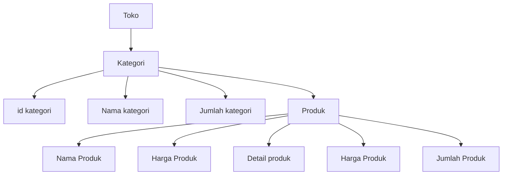
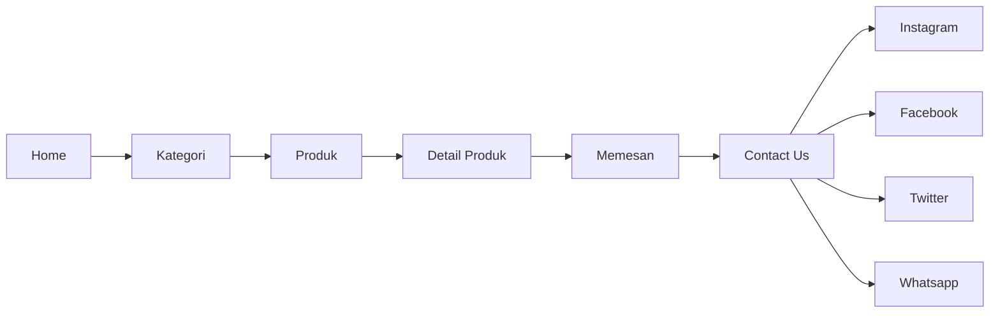

## 1.1 Latar Belakang

Pada zaman sekarang semua kalangan banyak yang mementingkan fashion, dan banyak juga orang orang yang masih bingung dalam pemilihan styling outfit
Mempermudah para costumer untuk melihat produk fashion yang di inginkan melalui website katalog produk ini 
## 1.2. Deksripsi Teknologi Informasi

Website katalog produk adalah sebuah situs web yang menampilkan daftar produk yang dijual oleh suatu perusahaan atau toko online. Katalog produk biasanya menyertakan informasi seperti deskripsi produk, harga, gambar, dan fitur-fitur lain yang berguna bagi pelanggan.

## 1.3. Branding

Logo:
Desain logo yang modern,dikombinasikan dengan unsur fashion seperti garis-garis atau elemen abstrak yang mencerminkan kechic-an.

Warna:
Pilih palet warna yang kontemporer dan stylish. Misalnya, kombinasi hitam, putih, hijau tua dan abu-abu dapat memberikan kesan urban dan elegan.

Slogan:
"City Style, Urban Elegance" atau "Where Urban Meets Chic" adalah contoh slogan yang dapat mencerminkan perpaduan gaya perkotaan dengan keanggunan.

Tagline:
Buat tagline yang singkat dan menarik seperti "Step into the UrbanChic Lifestyle" atau "Elevate Your Style, Embrace the City."

Media Sosial:
Aktif di platform media sosial dengan konten yang memamerkan gaya perkotaan yang trendi. Gunakan hashtag seperti #UrbanChicStyle untuk meningkatkan visibilitas.

Pengemasan:
Desain kemasan yang eksklusif dan modern untuk meningkatkan kesan produk. Pastikan bahwa pengalaman membuka paket mencerminkan kechic-an yang dijanjikan.

Inovasi Produk:
Tawarkan produk-produk dengan desain yang modern dan sesuai dengan tren perkotaan. Kolaborasi dengan desainer lokal atau influencer fashion dapat menambah nilai pada brand.

Kenyamanan Pelanggan:
Fokus pada pelayanan pelanggan yang baik dan berikan pengalaman belanja yang nyaman. Pertimbangkan program loyalitas atau diskon khusus untuk pelanggan setia.

Acara atau Kolaborasi:
Seringkali mengadakan acara atau kolaborasi dengan komunitas perkotaan atau influencer yang memiliki gaya yang sejalan dengan brand UrbanChic.

Kampanye Visual:
Gunakan kampanye visual yang mempromosikan produk dengan gaya yang edgy dan modern. Video atau foto sesi pemotretan dengan latar perkotaan dapat memberikan kesan yang kuat.

## 2. User Story

Sebagai | Saya bisa | Sehingga | Prioritas
---|---|---|---
Admin |Mempunyai akun sendiri | Dapat login ke laman admin | ⭐⭐⭐
Admin | Masuk ke laman admin | Dapat mengatur data | ⭐⭐⭐⭐
Admin | Mengatur data | Dapat mengatur data produk | ⭐⭐⭐
Admin | Mengatur data | Dapat menambahkan dan menghapus data kategori | ⭐⭐⭐
Admin | Mengatur data | Dapat menambahkan dan menghapus data produk | ⭐⭐⭐
Admin | Menambahkan detail produk | Dapat menambahkan jumlah produk,gambar produk dan ketersediaan produk | ⭐⭐
Admin | Diadakan contact us | Pengguna dapat memesan melalui laman contact us admin | ⭐⭐⭐⭐
Pengguna | Masuk ke laman utama pengguna | Dapat melihat katalog sebuah produk | ⭐⭐⭐⭐⭐
Pengguna | Melihat kategori produk | Dapat melihat produk per kategori contohnya hanya baju saja atau hanya celana saja  | ⭐⭐⭐
Pengguna | Mencari produk yang diinginkan | Dapat melihat produk yang di inginkan saja  | ⭐⭐⭐
Pengguna | Melihat detail produk | Dapat melihat produk yang di inginkan agar lebih jelas dan detail | ⭐⭐⭐
Pengguna | Melihat ketersedian produk | Dapat melihat ketersediaan produk yang di inginkan agar bisa memesan produk  | ⭐⭐⭐⭐
Pengguna | Melihat deskripsi produk | Dapat membaca dan melihat produk lebih detail mulai dari bahan yang di gunakan, ukuran, dan warna produk yang tersedia  | ⭐⭐⭐
Pengguna | Melihat laman about us | Dapat melihat tentang toko yang di kunjungi  | ⭐⭐
Pengguna | Melihat contact toko | Dapat memesan melalui contact toko tersebut  | ⭐⭐⭐⭐
Pengguna | Memasuki laman see more | Dapat melihat semua kategori dan produk dengan lebih lengkap | ⭐⭐⭐⭐

## 3. Struktur Data

## 4. Arsitektur Sistem

## 5. Teknologi, Library, dan Framework

Menggunakan database dari PhPmyAdmin,mysql,MariaDB
Dibuat menggunakan HTML,css,javascript
Menggunakan tambahan seperti bootstrap dan fontawesome untuk menambahkan beberapa fitur
 Serta Menggunakan text editor VS Code

## 6. Desain User Experience dan User Interface

Halaman login admin
(https://ibb.co/Sd21Pv8)

Halaman home admin
(https://ibb.co/XpxD8mJ)

Halaman Kategori admin
(https://ibb.co/NyTc1Nc)

Halaman Produk admin
(https://ibb.co/5cVn7SK)

Halaman Home pengguna
(https://ibb.co/NCjjtfL)

Halaman Produk Pengguna
(https://ibb.co/hRGLrgK)

Halaman Contact Us
(https://ibb.co/YL4Xnnm)

Halaman About Us
(https://ibb.co/S73zG6Z)

## 7. Demonstrasi Video

POV Admin : (https://drive.google.com/file/d/1rUwPmkgZnkwPZSWDObZx9Gq5u6b2oXss/view?usp=drive_link)

POV User : (https://drive.google.com/file/d/1oELpA8QlKsXy6BrnG8oWA7SFBkqpOdTE/view?usp=drive_link)

## 8. Bagaimana mesin komputasi dan sistem operasi berperan dalam produk teknologi informasimu ?

Link youtube nya di detik jawaban ini

## 9. Bagaimana algoritma, struktur data, dan bahasa pemrograman berperan dalam produk teknologi informasimu ?

Link youtube nya di detik jawaban ini

## 10. Bagaimana metode pengembangan perangkat lunak / Software Development Life Cycle berperan dalam produk teknologi informasimu ?

Link youtube nya di detik jawaban ini

## 11. Bagaimana database / sistem basis data berperan dalam produk teknologi informasimu ?

Link youtube nya di detik jawaban ini
